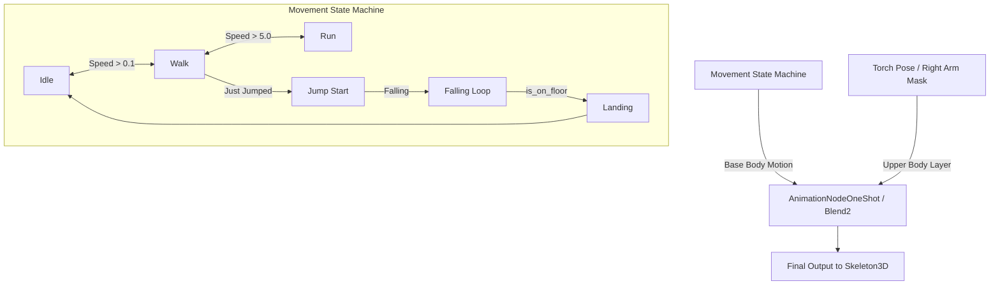

# Character Animation & Renovation Guide (Saad)

*Project Hollow Streets v2.0 (Saad & Hridy)*  
*Comprehensive Blueprint for Character Animation Overhaul*

---

## 1. Executive Summary & Strategic Choices

The current character controller in [`scripts/player.gd`](file:///c:/Users/USER/Desktop/saad%20game/Saad_Hridy/scripts/player.gd) relies on mathematical procedural motion (footfall curve bobbing, turning lean, and squash-and-stretch) because [`assets/saad_model.glb`](file:///c:/Users/USER/Desktop/saad%20game/Saad_Hridy/assets/saad_model.glb) is an unrigged 3D scan with no skeleton or bones.

To make Saad look and move like a modern, professional game character, we have **two distinct visual directions**:

```
                       ┌─────────────────────────────────────┐
                       │  Character Renovation Architecture │
                       └──────────────────┬──────────────────┘
                                          │
            ┌─────────────────────────────┴─────────────────────────────┐
            ▼                                                           ▼
┌───────────────────────────────┐                       ┌───────────────────────────────┐
│     PATH 1: Full 3D Rigged    │                       │     PATH 2: 2.5D Billboard    │
│    Skeletal Animation (GLB)   │                       │       Sprite Sheets (2D in 3D)│
├───────────────────────────────┤                       ├───────────────────────────────┤
│ • Modern 3rd-person look      │                       │ • Stylized retro aesthetic    │
│ • Smooth limb & walk cycles   │                       │   (Signalis, Octopath, Doom)  │
│ • Upper-body torch aiming     │                       │ • Hand-drawn or pixel sprite  │
│ • Mixamo / Blender pipeline   │                       │ • Multi-directional frames    │
└───────────────────────────────┘                       └───────────────────────────────┘
```

---

## 2. PATH 1: Full 3D Skeletal Rigging (Recommended for 3D Third-Person)

This is the standard approach for 3D third-person games. It retains the 3D model of Saad, adds a skeleton with bone weights, and drives it using Godot 4's `AnimationTree`.

### 2.1 Step-by-Step Auto-Rigging with Mixamo (Free & Fast)
Since you already have `saad_model.glb`:
1. **Convert / Prepare:** Export or convert `saad_model.glb` to `.obj` or `.fbx` (or open in Blender and export as `.fbx`). Ensure Saad is facing forward in a clean **T-Pose** or **A-Pose**.
2. **Upload to [Mixamo.com](https://www.mixamo.com/):**
   * Upload the model.
   * Place the 5 visual markers: Chin, Wrists, Elbows, Knees, and Groin.
   * Select `Standard Skeleton (65 bones)` or `No Fingers (28 bones)`.
   * Click **Finish**—Mixamo will automatically bind the skin weights to the skeleton!
3. **Download Required Animation Clips:**
   Download the following animations as **FBX with Skin** for the base, and **FBX without Skin** (to save file size) for the remaining animations:

| Animation Clip | Mixamo Search Term | Settings | In-Game Usage |
| :--- | :--- | :--- | :--- |
| **Idle** | `Sad Idle` or `Breathing Idle` | In Place: On | When stationary |
| **Walk** | `Walking` or `Sneak Walk` | In Place: **Checked** | Normal movement ($4.5\text{ m/s}$) |
| **Run** | `Running` or `Jogging` | In Place: **Checked** | Sprinting with Shift ($7.5\text{ m/s}$) |
| **Jump Start** | `Jump Up` / `Jump` | In Place: **Checked** | Ascending jump |
| **Fall / In Air** | `Falling Idle` | In Place: **Checked** | Mid-air airtime |
| **Landing** | `Jump Land` | In Place: **Checked** | Transition back to floor |
| **Torch Hold** | `Holding Lantern` / `Pistol Aim` | Upper-body only | Right arm raised holding torch |

4. **Importing into Godot 4:**
   * Place the `.glb` or `.fbx` files in `res://assets/character/`.
   * Godot automatically generates the `Skeleton3D` and `AnimationPlayer`.

---

### 2.2 Godot 4 Animation Architecture (`AnimationTree`)

To blend between Idle, Walk, Run, and Jump while holding the flashlight, we use an **AnimationNodeBlendTree** with upper-body masking:



#### Upper-Body Bone Masking (Torch Isolation)
By using a **Blend2** node with a bone filter configured for `RightShoulder`, `RightArm`, `RightForeArm`, and `RightHand`:
* Saad can walk, run, or jump with realistic leg swings.
* His right arm **stays locked in place holding the flashlight beam forward** regardless of how his legs move!

---

## 3. PATH 2: 2.5D Animated Billboard Sprite Sheets

If you want a stylized, retro-horror aesthetic (like *Signalis*, *Octopath Traveler*, *Daggerfall*, or *Paper Mario*), Saad can be rendered as a multi-directional 2D sprite within the 3D world.

### 3.1 How Billboard Sprites Work in Godot 4
* The player uses a `Sprite3D` or `AnimatedSprite3D` node with:
  * `billboard = BaseMaterial3D.BILLBOARD_Y` (always faces the camera horizontally).
* A script calculates the angle between the **camera's view direction** and the **player's movement direction** to pick the correct directional animation row.

---

### 3.2 Sprite Sheet Specifications & Layout

To create or generate sprite sheets for Saad (via AI image generators, pixel art software like Aseprite, or rendering out 2D frames from 3D):

#### A. 8-Directional Setup (Fluid & Smooth)
Eight camera angles are needed for full 3D navigation:
1. **Front (South)** - Moving toward camera
2. **Front-Right (South-East)**
3. **Right (East)** - Moving right
4. **Back-Right (North-East)**
5. **Back (North)** - Moving away from camera
6. **Back-Left (North-West)**
7. **Left (West)** - Moving left
8. **Front-Left (South-West)**

```
             North (Back)
                  ▲
     North-West   │   North-East
         ↖       │       ↗
           \     │     /
West ───────  [Saad]  ─────── East
           /     │     \
         ↙       │       ↘
     South-West   │   South-East
                  ▼
            South (Front)
```

#### B. Sprite Grid Dimensions & Frame Counts

| Animation Action | Directions | Frames per Dir | Total Frames | Recommended Resolution |
| :--- | :---: | :---: | :---: | :--- |
| **Idle** | 8 | 4 to 6 frames | 32 - 48 frames | $64 \times 64$ or $128 \times 128$ px per frame |
| **Walk** | 8 | 8 frames | 64 frames | $64 \times 64$ or $128 \times 128$ px per frame |
| **Run** | 8 | 6 to 8 frames | 48 - 64 frames | $64 \times 64$ or $128 \times 128$ px per frame |
| **Jump / Fall** | 8 | 3 frames | 24 frames | $64 \times 64$ or $128 \times 128$ px per frame |
| **Flashlight Aim**| 8 | 4 frames | 32 frames | $64 \times 64$ or $128 \times 128$ px per frame |

#### C. Sprite Sheet Grid Standard
* **Cell Size:** Uniform power-of-two cells (e.g., $128 \times 128$ pixels per frame).
* **Texture Atlas Size:** $1024 \times 1024$ px or $2048 \times 2048$ px with transparent background (PNG format).
* **Organization:** Each row represents one direction (0: South, 1: South-East, 2: East, etc.), and columns represent animation frames (Frame 0 to Frame 7).

---

### 3.3 Prompts for Generating Sprite Sheets (If Using AI Tools)

If you plan to use an image generator to create sprite sheets for Saad:

#### Base Character Concept Prompt:
> *"Character sprite sheet, full-body turnarounds of a young man named Saad, wearing a dark trenchcoat/jacket, boots, and holding a metallic flashlight in his right hand, gritty nighttime horror aesthetic, clean transparent background, consistent proportions, neutral lighting."*

#### Walking Cycle Prompt:
> *"2D character animation sprite sheet grid, 8-frame walk cycle, side view / front view / back view, consistent character with trench coat and flashlight, 128x128 pixel per frame grid, clean alpha background, retro survival horror style."*

---

## 4. Comparison Summary: Which Should You Pick?

| Feature | Path 1: 3D Skeletal Rig | Path 2: 2.5D Sprite Sheet |
| :--- | :--- | :--- |
| **Visual Style** | Modern 3D / Realism | Retro / PS1 / Stylized Aesthetic |
| **Lighting Interaction** | Full normal maps, specular highlights & torch cast shadows | Flat billboard with 2D normal maps (or unlit) |
| **Camera Freedom** | Seamless $360^\circ$ full vertical and horizontal orbit | Looks best with constrained camera pitch |
| **Effort to Produce** | Fast (Mixamo auto-rig in 5 mins + free animations) | Higher effort (requires generating or drawing 64+ frames per action) |
| **Flashlight Aiming** | Dynamic 3D IK / bone pointing anywhere the camera looks | Fixed 2D drawn angles |

---

## 5. Next Steps & Implementation Roadmap

1. **Decide the Path:** Choose between **Path 1 (3D Rigged Model)** or **Path 2 (2.5D Billboard Sprite Sheet)**.
2. **If Path 1 (3D):**
   * Auto-rig `saad_model.glb` via Mixamo or Blender.
   * Download the animation pack (`Idle`, `Walk`, `Run`, `Jump`).
   * We will configure Godot's `AnimationPlayer` and `AnimationTree` with upper-body torch blending.
3. **If Path 2 (2D Sprites):**
   * Generate or assemble the sprite sheet PNG files using the specifications above.
   * We will replace `SaadModel` in `player.tscn` with an `AnimatedSprite3D` and an 8-direction camera angle calculator.
